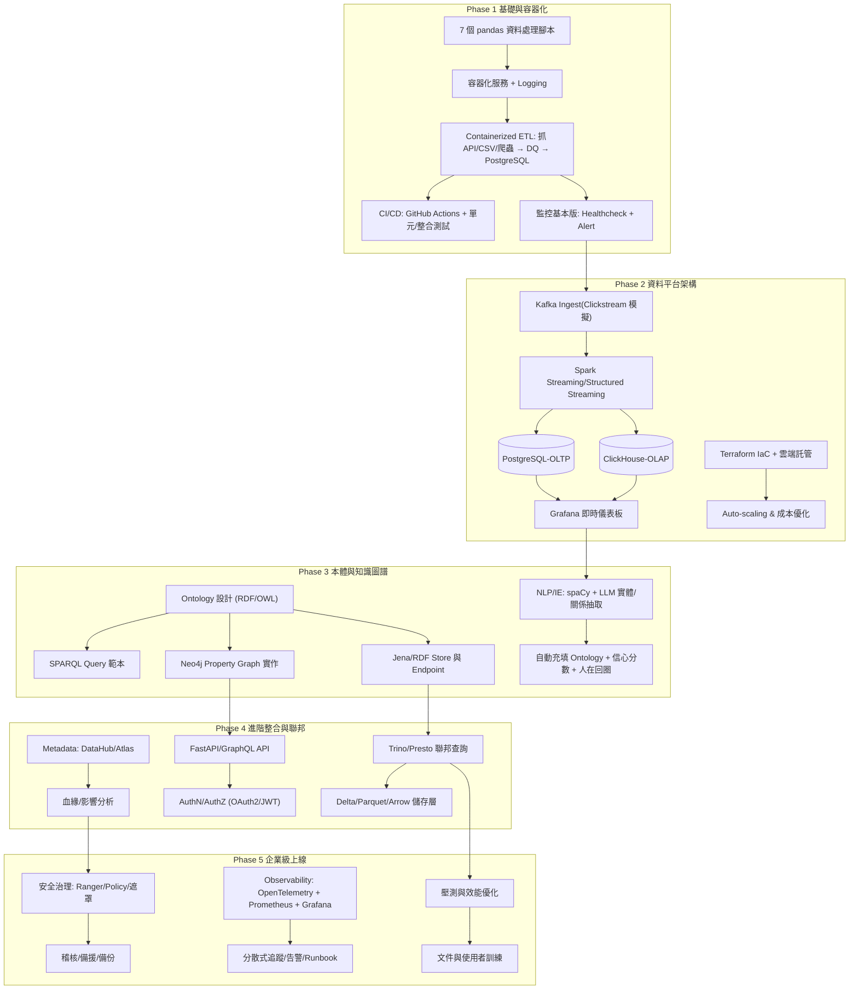

# DE2025 — Data Engineering Projects

> 目標：端到端資料平台（ETL → Streaming → OLAP/Graph → Ontology/Knowledge Graph → Federation → Governance/Observability），並以企業級實務標準產出程式碼、文件與監控

---

## Roadmap




## About this repo

- **產出**：`artifacts/`（每週 demo 的輸出，例：`/artifacts/w1/`）
- **已完成的文檔**：`docs/progress/W{週}.md`


## Quick Start
```bash
# 安裝依賴與虛擬環境（uv 可改為 pip）
uv venv && uv sync

# 基本任務（Makefile）
make fmt      # ruff format
make lint     # ruff check
make type     # mypy
make test     # pytest
make demo     # 本週 demo；輸出固定在 artifacts/
```

## Portfolio
- README 保持**一頁總覽**與快速啟動；詳情請見 Notion 主頁與 `docs/progress/` 歸檔